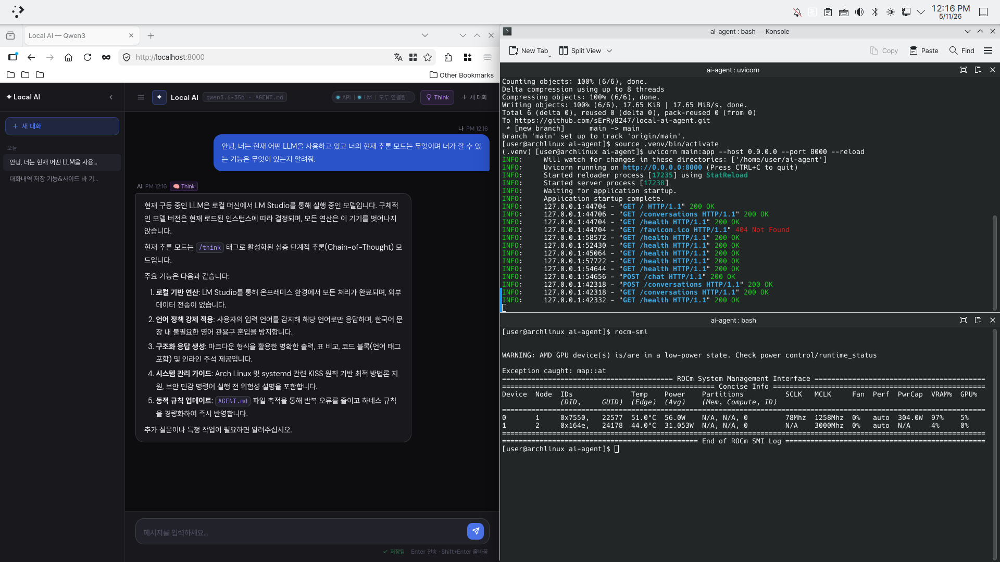
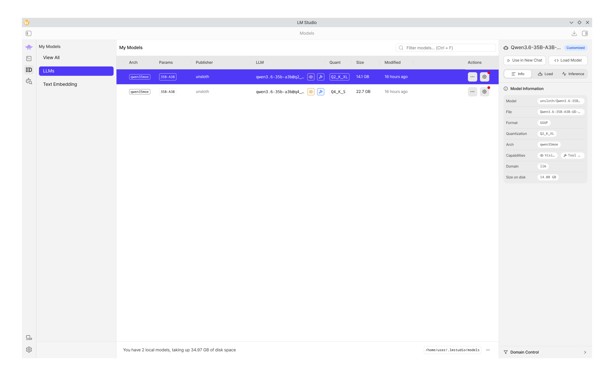
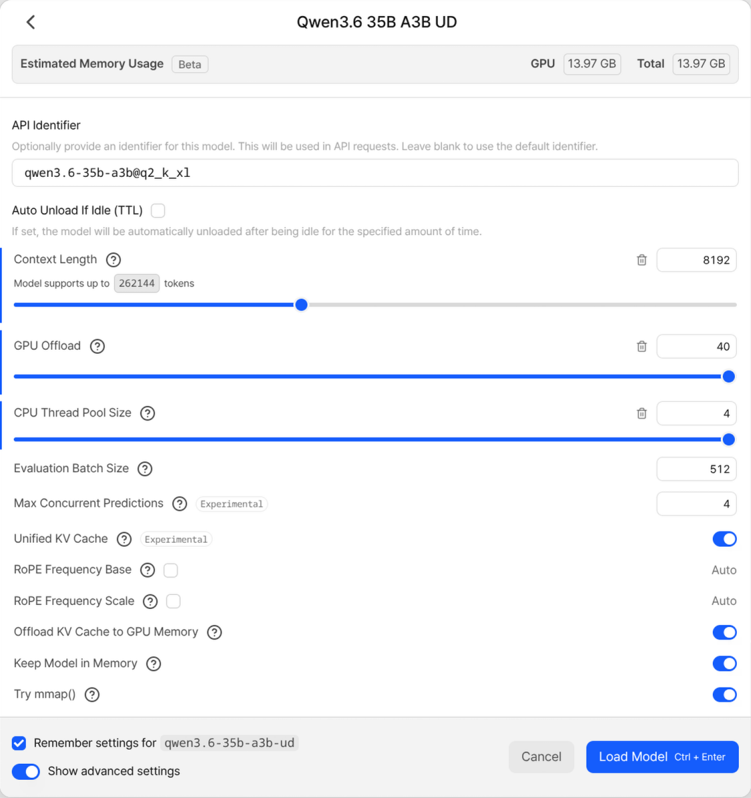
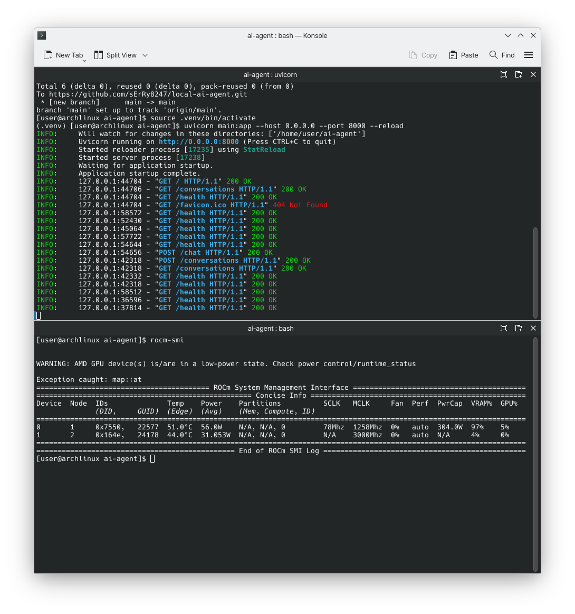

# Local AI Agent

> 사용자 데이터가 외부로 나가지 않는 완전 로컬 AI 챗봇



---

## 구축 동기

대부분의 사람은 GUI 환경에서 전문가와 직접 대화하듯 소통하는
방식에 익숙하다. 프라이버시를 지키면서도 그런 경험을 제공하는
AI를 직접 만들고자 이 프로젝트를 시작했다.

기존 AI 서비스는 자연스러운 대화 경험을 제공하지만 사용자
데이터가 외부 서버로 전송된다. 반대로 완전히 오프라인인 환경은
안전하지만 사용하기 불편하다. 이 두 가지를 동시에 해결하는 것이
이 프로젝트의 목표다.

이 철학은 Apple의 온디바이스 처리 방식과 같다.
연산은 기기 안에서, 데이터는 밖으로 나가지 않는다.

---

## 스택

| 항목 | 내용 |
|---|---|
| LLM | Qwen3-35B Q2_K_XL (LM Studio 로컬 구동) |
| Backend | FastAPI + SSE 실시간 스트리밍 |
| Frontend | HTML / CSS / JavaScript |
| OS | Arch Linux |
| GPU | AMD RX 9070 XT (RDNA4, 16GB VRAM) |

---

## 주요 구현 내용

### 1. SSE 기반 실시간 스트리밍 채팅 인터페이스
토큰이 생성되는 즉시 화면에 출력되는 스트리밍 구조를 직접
설계했다. 스트리밍 중 불완전하게 수신된 태그가 마크다운 파서를
망가뜨리는 버그를 indexOf 기반 파서로 직접 추적하고 수정했다.

### 2. GPU 최적화: 24 t/s → 120 t/s (5배 개선)
모델 크기(22.68GB)가 VRAM(16GB)을 초과해 CPU 오프로드가
발생했다. 양자화(Q4_K_S → Q2_K_XL)와 GPU 레이어 최대화로
추론 속도를 5배 끌어올렸다.

### 3. AGENT.md 핫 리로드
모델의 행동 원칙을 별도 파일(AGENT.md)로 분리해 서버 재시작
없이 즉시 반영되는 구조를 설계했다. Think/Fast 모드 전환도
서버에서 자동으로 접두어를 삽입하는 방식으로 제어한다.

### 4. 대화 내역 자동 저장
대화를 .md 파일로 자동 저장하며 Obsidian과 호환된다.
사이드바 UI로 이전 대화를 불러오거나 이어갈 수 있다.

---

## 실행 화면

| 모델 정보 | GPU 설정 |
|---|---|
|  |  |



---

## 실행 방법

```bash
# 의존성 설치
pip install fastapi uvicorn httpx

# 서버 실행
uvicorn main:app --reload

# 브라우저에서 접속
http://localhost:8000
```

> LM Studio가 localhost:1234에서 실행 중이어야 한다.

---

## 향후 목표

### 에이전트 기능 확장
현재 채팅 인터페이스에 백엔드 에이전트를 추가해 다음 기능을
구현할 계획이다.

- **Obsidian PKM 연동**: 대화 내용을 자동으로 노트로 정리하고
  기존 지식 베이스와 연결
- **온라인 검색 통합**: 온디바이스 처리를 기본으로 하되,
  필요 시 외부 검색을 자연스럽게 연결
- **사용자 작업 자동화**: 반복 작업을 에이전트가 스스로
  판단하고 처리하는 구조

### Apple 생태계 연결
Linux 위에서 구현한 온디바이스 AI 철학을 Apple Silicon의
Neural Engine과 Core ML 위에서 구현하는 것이 궁극적인 목표다.
온디바이스 AI를 기본으로 하되, 처리 한계에 따라 클라우드로
자연스럽게 연결되는 하이브리드 구조를 Apple 생태계 위에서
만들 계획이다.
